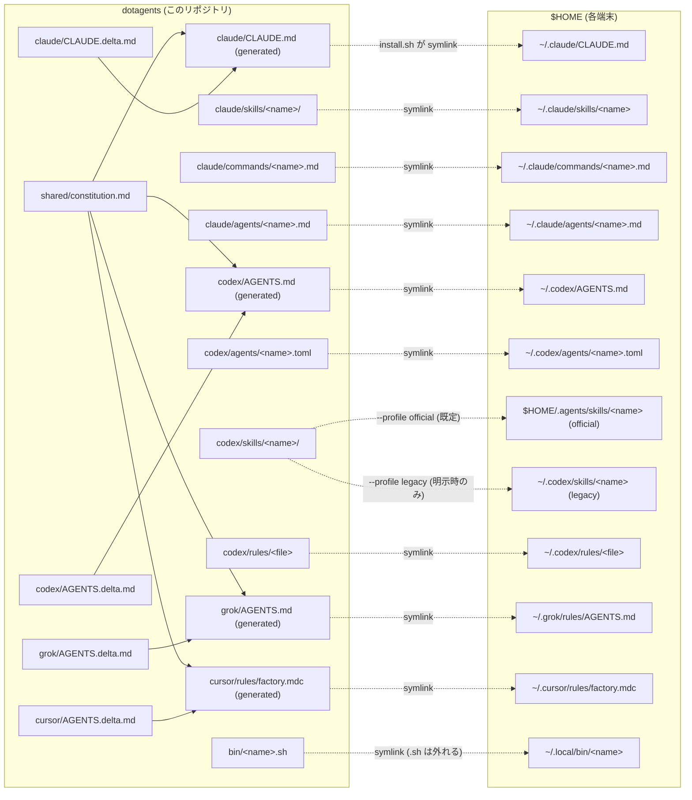

# dotagents

Claude Code / Codex の環境そのもの（skill・command・agents・rule・グローバル共通憲法・調査資産・環境整備の聖典）を**複数端末で同期する個人 dotfiles**。GitHub が真実の源。

- **趣旨・原則・残件**: [PLAN.md](PLAN.md)（憲章＝聖典 v4。プランは docs/ に作る。目的・判断理由・受入条件と工程正本への導線を持つ）
- **AI 向けの掟（全エージェント共通）**: [AGENTS.md](AGENTS.md)（Claude は [CLAUDE.md](CLAUDE.md) が `@AGENTS.md` で取り込む）。**URL を渡された AI のオンボーディング入口も AGENTS.md**（「AI オンボーディング」節）

## 構成

```
dotagents/
├── PLAN.md              … 開発工場の憲章（趣旨・原則・定常運用・残件）
├── AGENTS.md            … 全 AI 共通のプロジェクト正典＋AI オンボーディング入口
├── CLAUDE.md            … Claude 用の薄いラッパ（@AGENTS.md ＋ ベル固有）
├── install.sh           … symlink 配置（冪等・実ファイルは SKIP・失敗は停止）
├── docs/                … 00_overview.md（地図）・02_models.md（役割→モデル×effort順位表）・01_project-layout.md・進行中プラン／archive/（役目を終えた文書）
├── rag/                 … 調査・研究の再利用棚（INDEX.md＋topic/raw/ 一次ソース）
├── shared/
│   └── constitution.md  … Claude/Codex/Grok/Cursor共通憲法の唯一の手編集正本
├── claude/
│   ├── CLAUDE.delta.md  … Claude固有差分の正本
│   ├── CLAUDE.md        … 共通＋deltaの生成物（→ ~/.claude/CLAUDE.md）
│   ├── skills/          … → ~/.claude/skills/<name>
│   ├── commands/        … → ~/.claude/commands/<name>.md
│   └── agents/          … → ~/.claude/agents/<name>.md
├── codex/
│   ├── AGENTS.delta.md  … Codex固有差分の正本
│   ├── AGENTS.md        … 共通＋deltaの生成物（→ ~/.codex/AGENTS.md）
│   ├── agents/          … → ~/.codex/agents/<name>.toml
│   ├── skills/          … → $HOME/.agents/skills/<name>（既定。legacy は明示指定）
│   └── rules/           … → ~/.codex/rules/<file>
├── grok/
│   ├── AGENTS.delta.md  … Grok固有差分の正本
│   ├── AGENTS.md        … 共通＋deltaの生成物（→ ~/.grok/rules/AGENTS.md）
│   ├── skills/          … → ~/.grok/skills/<name>
│   └── agents/          … → ~/.grok/agents/<name>.md
├── cursor/
│   ├── AGENTS.delta.md  … Cursor固有差分の正本
│   ├── AGENTS.md        … 共通＋deltaの生成物（リポ内保持。HOMEへは置かない）
│   ├── rules/factory.mdc … 同一本文の alwaysApply 規則（→ ~/.cursor/rules/factory.mdc）
│   ├── skills/          … → ~/.cursor/skills/<name>
│   └── agents/          … → ~/.cursor/agents/<name>.md
└── bin/                 … 配布scriptだけ → ~/.local/bin/<name>（拡張子は外れる。repo専用rendererは非配布）
```



Codex skill は同一端末・同一入口で **official / legacy の一方だけ**に置く。既定は公式 user skill 面
`$HOME/.agents/skills`。古い入口の互換検証だけ `./install.sh --profile legacy` を明示し、
`verify-install --profile legacy` を通す。installer は反対面を勝手に削除しない。

## 同梱資産

| 種類 | 名前 | 用途 |
|---|---|---|
| Claude skill | `orchestrate` | 共有Control lifecycle／委譲契約を読み、Claude固有status projectionとWorkflow appendixを使う入口 |
| Codex skill | `orchestrate` | 共有Control lifecycle／委譲契約を読み、native・外部実行・相談レーンを裁定する製品固有入口 |
| 共有契約 | `shared/orchestrate/{contract,delegation-contract}.md` | 両skillのuse-not-use、Control lifecycle、製品中立のDelegation Packet／Worker Reportの唯一の正本 |
| Claude skill | `auto-deploy-on-push` | push 契機の SSH + docker compose 自動デプロイ構築 |
| Codex skill | `auto-deploy-on-push` | read-only調査とH承認を先行するpush起点デプロイ構築 |
| Claude agent | `implementer` | 委譲契約焼き込み済みの実装者（安価枠。順位表は docs/02_models.md） |
| Claude agent | `refuter` | 敵対的検証者（読み取り専用） |
| Claude command | `auto-deploy-on-push` / `polish-github` | 各スキルの入口 |
| Codex skill | `polish-github` | GitHub presentation 整備（正本は Claude 版・Codex 版は薄いポインタ＝一本化済み） |
| Codex rule | `default.rules` | Codex 常時適用ルール |
| 共通憲法 | `shared/constitution.md` | Claude／Codex／Grok／Cursorへ生成する人格・応対・安全・調査・計画・git・報告の唯一の共通正本 |
| Claudeグローバル規範 | `claude/CLAUDE.delta.md` → `claude/CLAUDE.md` | 共通憲法＋Claude固有deltaから合成する配布生成物 |
| Codexグローバル規範 | `codex/AGENTS.delta.md` → `codex/AGENTS.md` | 共通憲法＋Codex固有deltaから合成する配布生成物。配置・配線の正典はdocs/02・docs/05 |
| Grokグローバル規範 | `grok/AGENTS.delta.md` → `grok/AGENTS.md` | 共通憲法＋Grok固有deltaから合成する配布生成物。配置先は`~/.grok/rules/AGENTS.md` |
| Cursorグローバル規範 | `cursor/AGENTS.delta.md` → `cursor/AGENTS.md` と `cursor/rules/factory.mdc` | 共通憲法＋Cursor固有delta。runtime mountは`~/.cursor/rules/factory.mdc`のみ |
| Cursor skill | `orchestrate` / `auto-deploy-on-push` / `gpt-connector` / `polish-github` | 共通契約＋Cursor appendix。`~/.cursor/skills`。`skills-cursor/`は触らない |
| Cursor agent | `implementer` / `refuter` | `~/.cursor/agents`。bundled explore/planは置換えない |
| Grok skill | `orchestrate` / `auto-deploy-on-push` / `gpt-connector` / `polish-github` | 共通契約＋Grok appendix。`~/.grok/skills`が同名のCodex/Claude面に勝つ |
| Grok agent | `implementer` / `refuter` | `~/.grok/agents`。bundled explore/planは置換えない |
| bin | `render-global-constitution.mjs` | 共通憲法＋host deltaから4 harness向け完全指示を冪等生成し、driftを検査 |
| repo内検査 | `bin/render-current-docs.mjs` | 配備契約から現行状態を生成し、ASTで全documentの所有surface、local link、archive inventory、凍結digestを検査。`npm ci --ignore-scripts`後にrepo内で実行し、`~/.local/bin`へは配布しない |
| bin | `apply-grok-config` | Grok の `compat.claude.agents=false` / `hooks=false` と工場MCP 6を dry-run / backup / 冪等適用する（`--apply` は端末承認後。正典はdocs/07） |
| bin | `apply-cursor-config` | Cursor の工場MCP 6を `~/.cursor/mcp.json` へ dry-run / backup / 冪等適用する（`--apply` は端末承認後。正典はdocs/08）。`cli-config.json` は触らない |
| Codex サブエージェント | `codex/agents/{implementer,refuter,sorter}.toml` | ネイティブ委譲のrole定義（役割→model×effortの正は docs/02_models.md） |
| bin | `agents-update.sh` | deployment contractのhost別CLI／SDK集合を`@latest`へ更新し、post-update gateとreportを実行 |
| bin | `setup-macos-factory.sh` / `setup-linux-factory.sh` / `setup-linux-workstation-factory.sh` / `setup-windows-native-factory.ps1` | host別の工場一撃展開。Linux 2席は共通本体を使いながらserver/workstationの役割を分離し、各OS固有の配線と全製品smokeを行う。Windows入口はmain-serverへの恒久SSHも所有する |
| GitHub Actions | `enroll-windows-main-server-ssh.yml` | Windows専用公開鍵をmain-server runner自身が`authorized_keys`へ冪等登録する。秘密鍵はWindowsから出さない |
| bin | `bughub-external-probe.mjs` | server profileからloopback `/readyz`とdeploy revision manifestを照合し、安全な固定checkへ投影 |
| bin | `factory-reporter.mjs` | 明示opt-inされた工場reportを検証・outbox保存・BugHubへ冪等送信 |
| bin | `factory-external-event.mjs` | Pi5等の外部監視結果をmain-serverの所有者限定stateへ固定ServerManager eventとしてappend-only記録し、BugHub受理後だけack |
| bin | `verify-codex-agent-routing.sh` | Control配下の書込みWorkerのspawn後、role/model/effort/developer instructionsを検証し、親継承のsandbox実効値を観測表示 |
| bin | `apply-codex-config.sh` / `apply-claude-config.sh` | Codex routing / hook と、Claudeの正本化・callout・advisory・Lattice Gantt・Git破壊操作hookを dry-run / backup / 冪等適用する（`--apply` は端末承認後） |
| 工場接続 | Caveat（dotagents 外） | 工場は `caveat mcp-server` と `caveat factory-diagnostics --json` の公開面だけを呼ぶ。導入・罠DB・同期・公開は [Caveat README](https://github.com/kitepon/Caveat#readme) が正 |
| 自作コア製品 | [工場の現行状態](docs/factory-current-state.md)に列挙（いずれもdotagents 外） | 罠知識、セッション継続、未使用ツール監査、工程graphとコード構造理解、ChatGPT接続、PTYと外部モデル枠、隔離Codex実行、macOS native開発面、中央運用管理、対等マルチエージェント円卓、日本語文章の校正規範を担う。AIShellはmacOS arm64専用。Observerは2026-08-16に工場コアから撤去。各製品の編入版は[製品契約台帳](docs/factory-product-contracts.md)が持つ |
| 第三者管理製品 | MarkItDown | 自作コアではなく、公開CLIだけをblack-box管理する資料変換器。fork・内部patchは行わない |
| 基盤toolchain | Claude Code CLI／Codex CLI／Grok Build | コア製品とは別区分。Oracleはv1互換・rollback専用。Mac自前 Desktop と main-server 自前 AFK は overlay で、正典は [docs/factory-grok-build-community-overlay.md](docs/factory-grok-build-community-overlay.md) |
| 中央管理コア | ServerManager（dotagents 外） | 自作コア一覧に含まれる中央運用管理製品。内部のBugHubをversion・bug・compatibility結果の統括に使い、BugHubを独立製品へ分離しない |
| コード構造・工程graph | Lattice（dotagents外） | 自作コア一覧に含まれる。Codegraphを完全吸収した正式後継で、`lattice-mcp`と同梱sensorを所有する。独立Codegraphはretired／not_applicable履歴だけを保持。[導入完了記録](docs/archive/plan_lattice-factory-integration.md) |
| 知識 | `rag/` | 調査の一次ソース＋結論（第二の脳。人間用の窓は Obsidian） |
| 設定 | `.codex-sidecar.yml` | codex-sidecar 委譲のプロジェクト既定（model/effort・readonly。正典 docs/05_codex-fragments.md） |

Claude command の Codex 正規入口は slash command の模造ではなく、対応 skill の明示 invocation とする。

| Claude command | Codex 入口 |
|---|---|
| `/auto-deploy-on-push` | `$auto-deploy-on-push` |
| `/polish-github` | `$polish-github` |

### 工場コア製品の変更管理

[工場の現行状態](docs/factory-current-state.md)に列挙された管理製品の追加・削除・第三者化・所有移管は、`PRODUCT_IDS`や表の1行だけを変えて終わりにしない。製品repoで導入・設定・状態・schema・migration・診断・復旧・更新・releaseの正本を先に確定し、dotagentsの[統合契約台帳](docs/factory-product-contracts.md)には製品ID、repo、version入口、公開diagnosticsとschema ID、adapter projection、privacy、host参照、製品文書へのpointerだけを記録する。

1. 追加は、製品repoで単独導入・更新・診断・復旧・releaseを確定してから、dotagentsへhost matrix、adapter、BugHubの固定product集合と期待matrix、privacy fixture、工場rollout/verifyだけを追加する。自作製品はnative diagnosticsを先に作り、dotagentsが内部DBを推測しない。
2. 削除は、`rg -a`とLattice sensorでconsumerを確認し、scheduler/outbox/runtime cursorを停止・drainしてから行う。BugHubの履歴を物理削除せず、移行中の旧clientは対象を`not_applicable`で報告し、server期待matrixから外す時期とclient/server双方が旧reportを扱う期間を明示する。
3. 第三者化は、製品repoへのinstrumentation・内部state解釈・fork/patchを撤去し、version範囲付きblack-box adapterへ切り替える。追従不能な状態は`unsupported`または`unverified`であり、greenへ丸めない。
4. 所有移管は、製品repo側でsource/state/schema、release/update、credential責務と修正先を更新し、dotagentsは統合pointerとadapterだけを追従する。製品のsourceやstateをdotagentsへ移さない。基準path・repo移動はこの変更とは別にオーナーの明示承認を取る。
5. wire schema majorを変える時は [factory reporterランブック](docs/factory-reporter-runbook.md#現役wire互換rollback) のserver-first・別endpoint・host単位cutoverを使う。全repoを独立commit/rollback可能にし、各gateとcanary後にだけ旧majorをretireする。
6. 自作コア製品の修理・releaseは各製品repoの正典と機械gateで完遂する。dotagentsはその手順を中央規定せず、公開後のversion/diagnostics probe、host rollout、wire横断受入だけを行う。公開不具合のrollback方式も製品repoが所有する。

### Codex 9面の対応状況

「全対応」はファイル数の左右対称ではなく能力対称で判定する。合格条件・進捗・各面の状態は
Codex全対応の工程状態はLattice storeが正本で、旧4 host・5入口の完了台帳は
[アーカイブ済み計画](docs/archive/plan_codex-full-support.md#8-端末台帳)に履歴として残す。現役hostと入口は下のhost別表を正とする。

| 面 | dotagents の正規入口 |
|---|---|
| AGENTS_MD | `codex/AGENTS.md`＋リポごとの `AGENTS.md` |
| CONFIG / MCP_SERVER_CONFIG | `docs/05_codex-fragments.md`＋`apply-codex-config`＋`verify-install` |
| SKILLS | `codex/skills/` → user skill 面（公式面が既定） |
| PLUGINS | — 非採用（個人git＋symlink配布と二重化するため） |
| SUBAGENTS | `codex/agents/*.toml`＋`verify-codex-agent-routing` |
| HOOKS | `bin/codex-callout-hook.sh`＋`docs/05_codex-fragments.md` |
| COMMANDS | Claude command に対応する Codex skill |
| SESSIONS | Throughline＋Codex handoff smoke |

## 他端末セットアップ・ランブック

### 0. 前提（未充足ならここで導入。所要時間は状態次第）

- **git**: 鍵設定済み・`gh auth status` OK・**identity 設定**（未設定だと hostname 由来の偽メールで履歴が汚れる）:
  ```bash
  git config --global user.name "quolu"
  git config --global user.email "226230081+quolu@users.noreply.github.com"
  git config --global init.defaultBranch main   # 新規リポが master で生まれるのを防ぐ（2026-07-04 実被弾）
  printf '.DS_Store\n' > ~/.gitignore_global && git config --global core.excludesfile ~/.gitignore_global  # macOS ノイズを全リポで抑止
  ```
- **host境界**: main-serverとrabbitは同じnative Linux基盤でも役割が異なる独立hostである。main-serverは`server` profileでServerManager／BugHubとpeertable serverを所有し、rabbitは`linux` profileのworkstation／peertable clientである。credential、config、scheduler、receiptを共有しない。FOXのWSL2席は2026-08-30に退役し、`wsl`は旧wire/outboxの読取互換だけに残す。
- **共通ランタイム**: node>=24＋corepack・python3（`node --version`がv24+、`python3 -c "print(1)"`が成功すること。Windows nativeは正規入口がNode 24、Python、uvなどの不足をwingetから導入する。Windowsのストア偽エイリアスは存在チェックを通り、黙ってexit 0を返すため実行判定する〔罠DB `windows-python3-store-exit-0`〕）。
- **Docker（POSIX hostのみ）**: 現行のmacOS／native Linux一撃入口は`docker info`までを前提にする。Windows native一撃展開と全製品smokeにはDockerを含めず、Docker DesktopやWSL backendを導入・起動・検証しない。Dockerが必要な個別deployはその製品・serverのランブックだけが要求する。
- **CLI（必須）**: 管理製品の列挙と区分は[工場の現行状態](docs/factory-current-state.md)、host別requiredは[host matrix](docs/factory-host-product-matrix.md)を使う。macOS 15+ Apple SiliconではAIShell、main-serverではServerManagerの公開readiness/revisionだけを検証する。他hostのServerManagerは`not_applicable`、AIShellは非macOSで`unsupported`である。基盤toolchainのClaude Code・Codex CLIは別管理。MarkItDownの正規更新面は`uv tool`、unaiは公式installerで更新する。
- Observerは工場コアから撤去済み。
- 独立CodegraphはPATHに存在してはならない。
- **CLI（任意）**: Grok Build＝**要 `grok login`（H）**。未認証だと `grok agent` が使えず、`delegate grok` は明示エラーで停止する。一撃展開は未loginでも止まらない（toolchain optional）。login済みの工場MCP適用（`apply-grok-config --apply`）はH。現役4席（Mac / main-server / rabbit native Linux / Windows native）は全部本線。Windows nativeのGrok親配線は`setup-windows-native-factory`が書く。旧4席の新規session受入履歴は2026-08-16に閉じたが、rabbitは別hostとして新たに受け入れる。
- **MCP 用 CLI を先に入れる**（下の登録が参照する。`agents-update`が入れる各packageと同源）: `aiterm-mcp`・`caveat`・`codex-sidecar-mcp`・`gpt-connector-mcp`・`lattice-mcp`がPATHにあること。独立Codegraphは登録しない。Codex親もnative枠外の実行用にaitermとcodex-sidecarを登録する。登録・loginは端末configを変えるH操作。
- **MCP（ユーザースコープ登録。上の CLI 導入後）**:
  ```bash
  claude mcp add --scope user aiterm -- aiterm-mcp
  claude mcp add --scope user caveat -- caveat mcp-server
  claude mcp add --scope user lattice -- lattice-mcp
  claude mcp add --scope user codex-sidecar -- codex-sidecar-mcp
  claude mcp add --scope user gpt_connector -- gpt-connector-mcp
  claude mcp add --scope user aishell --env AISHELL_CAPABILITY_SET=expanded-v1 -- aishell-mcp
  codex mcp add aiterm -- aiterm-mcp
  codex mcp add codex-sidecar -- codex-sidecar-mcp
  codex mcp add gpt_connector -- gpt-connector-mcp
  codex mcp add lattice -- lattice-mcp
  codex mcp add aishell --env AISHELL_CAPABILITY_SET=expanded-v1 -- aishell-mcp
  ```
  Grok親の工場MCP 6はClaude/Codexへ手挿しせず、`~/.grok/config.toml`が所有する。適用は`apply-grok-config`（login済み`--apply`はH）。個人MCPはClaude jsonに残してよい。`compat.claude.mcps`は切らない。Cursor親の工場MCP 6と工場hookは`bin/apply-cursor-config.sh --apply`が`~/.cursor/mcp.json` / `hooks.json`を upsert する（Cursor CLI の `mcp add` は無い）。`cli-config.json`は触らない
- **人間用の窓（任意だが標準）**: Obsidian（`brew install --cask obsidian`。無料・md 直読み。vault 設定 `.obsidian/` は端末ローカル＝gitignore 済み）
- **home-server ssh**: `kite@192.168.1.2`（固定IP）または`main-server`。Windows native入口はパスフレーズなしの専用鍵`~/.ssh/id_ed25519_main_server`、owner-only ACL、固定済みserver ED25519指紋、`IdentitiesOnly yes`を管理し、直IPとaliasの両方へ適用する。初回または認証喪失時は公開鍵だけをGitHub Actions secretへ置き、main-server上の`Enroll Windows main-server SSH` workflowで`authorized_keys`へ冪等登録する。server側鍵行はagent／port／X11 forwardingを禁止する
- **main-server → rabbit ssh**: `kite@192.168.1.55`または`rabbit`。rabbit一撃入口がUbuntu公式OpenSSH Server、鍵認証限定のsshd設定、`kite`専用passwordless sudoersをroot phaseで管理する。main-serverには専用鍵`~/.ssh/id_ed25519_rabbit`と固定済みrabbit ED25519 host keyを配線し、rabbit側はagent／port／X11 forwardingを禁止した公開鍵行だけを受け入れる。alias／直IP接続と`sudo -n`の実火が成功しない限りfail closedにする

### 1. clone（`Developer`配下へ集約。Windows nativeとPOSIXは別checkout）

macOS／native Linux:

```bash
gh repo clone kitepon/dotagents ~/Developer/dotagent   # gh 認証を使う（SSH 鍵の有無に依存しない）
cd ~/Developer/dotagent
```

Windows native（このPCの正規配置）:

```powershell
Set-Location C:\Users\kite_\Developer
gh repo clone kitepon/dotagents dotagent
Set-Location .\dotagent
```

一撃入口はcheckout自身からrepo rootを解決し、別hostのcheckoutや旧pathへ越境しない。

### 2. 既存実ファイルの退避（重要——install.sh は実ファイルを SKIP する）

`mkdir -p ~/Archives` してから:

```bash
tar czf ~/Archives/claude-pre-dotagents-$(date +%Y%m%d).tar.gz -C "$HOME" .claude/CLAUDE.md .claude/skills .claude/agents .claude/commands .codex/AGENTS.md .grok/rules/AGENTS.md .cursor/rules/factory.mdc 2>/dev/null || true
# グローバル CLAUDE.md / Codex AGENTS.md / Grok rules の実ファイルが残っていると正本化が静かに不成立になる
[ -f ~/.claude/CLAUDE.md ] && [ ! -L ~/.claude/CLAUDE.md ] && rm ~/.claude/CLAUDE.md
# ~/.codex/AGENTS.md が実ファイルなら先に中身を確認——価値ある行を共通正本／Codex deltaへ振り分け、生成物を更新してから退避・削除する
[ -f ~/.codex/AGENTS.md ] && [ ! -L ~/.codex/AGENTS.md ] && rm ~/.codex/AGENTS.md
[ -f ~/.grok/rules/AGENTS.md ] && [ ! -L ~/.grok/rules/AGENTS.md ] && rm ~/.grok/rules/AGENTS.md
```

### 3. 一撃展開 → 検証バッテリー

席への手作業の展開（SSHで1箇所から他席を回す場合を含む）は次だけとする。その席のdotagents作業ディレクトリへ移り、そこで親AI（Grok／Claude／Codex）を起動し、その親に下表の正規入口を実行させる。失敗はその席で原因を直してから閉じる。スクリプトをSSH先で無人実行して成功扱いにしない。`verify-install`やsetupのexit 0を親session受入の代用にしない。定期更新のcron／Taskはこの節の対象外。

初回導入と再適用の正規入口はhost別の一撃展開スクリプトである。4入口は同じ
`lib/factory/deployment-contract.mjs`を消費し、Windows native固有配線やLinuxのserver/workstation役割を共有実装へ
押し込まない。いずれも公式skill面、現役製品、MCP、Lattice／Spotter hook、定期更新、
`verify-install`、[工場の現行状態](docs/factory-current-state.md)が示すwireのfresh reportとBugHub delivery receiptまでを一括検証する。
Grok親の配布面（`~/.grok/rules` / `runbooks` / `skills` / `agents` / `hooks`）は`install.sh`がsymlinkする。
工場MCPと`compat.claude.agents`/`hooks`切断はlogin済みなら`apply-grok-config`が書く。未loginではスキップし、一撃展開は止まらない。Windows nativeもGrok親の対象。`setup-windows-native-factory`はlogin済みならそれを呼ぶ。
Cursor親の配布面（`~/.cursor/rules/factory.mdc` / `runbooks` / `skills` / `agents`）は`install.sh`がsymlinkする。工場MCPと工場hookは`apply-cursor-config`が`~/.cursor/mcp.json` / `hooks.json`へ書く。4入口はloginゲートせず呼ぶ。`cli-config.json`は触らない。

既存hostは実行前にfactory reporter runbook §1〜4に従い、そのhost専用のconfigとcredentialを配置して
[工場の現行状態](docs/factory-current-state.md)が示すreportingを有効にする。rabbit初回入口だけはmain-server SSHを確認後、`rabbit`／`linux` credential発行・安全な転送・config作成まで一撃内で行う。MCP login、GitHub認証、POSIX hostのDocker稼働など「0. 前提」のhost別外部状態は
スクリプトが捏造せず、欠けていれば名指しで停止する。Windows nativeではDocker／WSL2を外部前提に加えない。

工場の現役4席（Mac / main-server / rabbit native Linux / Windows native）は全部本線で、各席に独立した正規入口を持つ。

| host | 正規入口 | 定期更新 |
|---|---|---|
| macOS | `./bin/setup-macos-factory.sh` | LaunchAgent、毎週月曜04:00 |
| main-server | `./bin/setup-linux-factory.sh` | cron、毎日02:00。native Linuxの`server` profile専用 |
| rabbit native Linux | `./bin/setup-linux-workstation-factory.sh` | Ubuntu公式前提package、OpenSSH Server、`kite` passwordless sudo、main-serverからの専用鍵SSH、Node.js 24、uv、GitHub認証、main-server SSH／reporter credential、全工場製品を一括導入。cron、毎日02:00。`linux` profile専用 |
| Windows native | PowerShell 7（`pwsh.exe`）で `& .\bin\setup-windows-native-factory.ps1`。5.1しかない初回は同じscriptをWindows PowerShellから実行すれば、`winget`で公式`Microsoft.PowerShell` MSIをmachine scopeへ導入してPowerShell 7へ再起動する。`winget`も無い場合は公式GitHub releaseの`win-x64.msi`導入commandを明示して停止する（Store/MSIX App Execution Aliasはowner-only工場stateを読めないため不受理）。Git/Node 24/gh/Python/uv/make/ShellCheck/ripgrep/OpenSSHも不足時は正規packageを導入する。さらにmain-server専用鍵・固定host key・SSH config・公開鍵登録workflow・alias／直IPの非対話再接続を一括検証する。`.sh`実行に使う`C:\Program Files\Git\bin\bash.exe`／`sh.exe`はGit for Windowsのnative executableでありWSLではない。WSL2・Docker・Hyper-V・Virtual Machine Platformは不要 | Task Scheduler、毎日02:00。ユーザー権限。5.1／`cmd.exe`／WSLで工場処理を続行するfallbackなし |

macOSではAIShell（Apple Silicon／macOS 15+）も配備する。main-serverとrabbitは同じLinux共通本体を使うが、
profile、ServerManager所有、peertable役割、credential、scheduler、delivery receiptを共有しない。Windows native入口は`wsl.exe`を呼ばず、
WSL distroの有無や状態を成功条件にしない。

Windows nativeのmain-server SSH受入は、`ssh -o BatchMode=yes main-server`を3回と`ssh -o BatchMode=yes kite@192.168.1.2`を1回成功させること。通常の`ssh kite@192.168.1.2`で旧`id_ed25519`のpassphraseを聞かれる状態は不合格である。登録workflowが使う`MAIN_SERVER_WINDOWS_PUBLIC_KEY`は公開鍵だけであり、再適用可能な修復入口として保持してよい。

個別に適用・切り分ける場合は、以下の正規入口を順に使う。

```bash
./install.sh --profile official
./bin/apply-codex-config.sh --dry-run
./bin/apply-claude-config.sh --dry-run
./bin/apply-grok-config.sh --dry-run
./bin/apply-cursor-config.sh --dry-run
```

既定は公式 user skill 面 `$HOME/.agents/skills`。`--dry-run` は一切書き込まず、routing の必須2キー、
callout hook 4イベント、SessionStartの`orchestrate-advisory-hook` 1件、`codex-lattice-gantt-hook`のSessionStart / UserPromptSubmit entryを各1件だけの差分を出す。Grok側は`compat.claude.agents=false` / `hooks=false` と工場MCP 6の差分だけを出す。対象端末への適用を承認した後だけ、次を実行する。

```bash
./bin/apply-codex-config.sh --apply
./bin/apply-claude-config.sh --apply
./bin/apply-grok-config.sh --apply   # login済みだけ。未loginならスキップ（H）
./bin/apply-cursor-config.sh --apply
caveat init --sync --yes </dev/null
throughline install
lattice hooks install --host claude
lattice hooks install --host codex
lattice hooks install --host cursor
spotter install -y
./bin/verify-install.sh --profile official
```

上記4つの工場設定applierの `--apply` は `~/Archives/` に backup を作り、途中失敗時は rollbackする。`apply-claude-config` は本書のjq断片が正とするdotagents hookだけを追加し、model / effort / permissions / OAuth / trust / 他ツールのhookは変更しない。`apply-grok-config` は `[models]` / permission / login と個人MCPを触らず、`compat.claude.skills` と `compat.claude.mcps` は切らない。`apply-cursor-config` は `cli-config.json` の model / permission / login と個人MCPを触らない。legacyを選ぶのは旧入口の検証時だけで、`--profile legacy`をinstall / verifyの両方へ付ける。

Grok親の所有面は次だけである。Claude面を吸うことを完成形にしない。

| 面 | Grok所有 | Claude面 |
|---|---|---|
| 憲法 | `~/.grok/rules/AGENTS.md`（`grok/AGENTS.md`） | `compat.claude.agents=false` |
| runbook | `~/.grok/runbooks` | 吸わない |
| skill / agent | `~/.grok/skills` / `~/.grok/agents` | `compat.claude.skills`は切らない（Wave 2: `~/.grok/skills`が同名に勝つ） |
| 工場MCP | `~/.grok/config.toml` | `compat.claude.mcps`は切らない。同名はtomlが勝つ |
| 工場hook | `~/.grok/hooks/factory.json` | `compat.claude.hooks=false`。工場hookに製品hookは載せない |
| Lattice工程表 | `grok-lattice-gantt-hook`（dotagents所有の案内） | `lattice hooks install --host` にGrokを足さない |

Cursor親の所有面は次だけである。Claude面を吸うことを完成形にしない。

| 面 | Cursor所有 | やらないこと |
|---|---|---|
| 憲法 | `~/.cursor/rules/factory.mdc`（Desktop Agent へは `cursor-constitution-hook` が sessionStart・beforeSubmitPrompt・preToolUse で配達。10000 字以内なら同一本文、超過時は cap 内案内＋本文冒頭＋正本 Read。`~/.cursor/factory-constitution` は同一正本の overlay） | `~/.cursor/AGENTS.md`。User Rules UIへの手貼り。窓への自動 `--add` |
| runbook | `~/.cursor/runbooks` | |
| skill / agent | `~/.cursor/skills` / `~/.cursor/agents` | `skills-cursor/` |
| 工場MCP | `~/.cursor/mcp.json` | `cli-config.json`。個人MCPの移管 |
| 工場hook | `~/.cursor/hooks.json` | Claude envelopeへ変換。製品hookを工場hookへ載せない |

`throughline install` は一撃展開が呼ぶ Throughline の製品管理入口である。生成物、host別hook、再適用条件は [Throughline README「In 30 seconds」](https://github.com/kitepon/Throughline#in-30-seconds) を正とし、dotagentsは製品hookを生成・再収録しない。

`spotter install -y` は一撃展開が呼ぶSpotterのproject-scoped配布入口である。生成物、host別hook、連携オプション、再適用条件は[Spotter README「Install」](https://github.com/kitepon/Spotter#install)を正とする。dotagentsはSpotterのmarkerやhookを複製・手書きせず、製品CLIへの接続だけを所有する。

`lattice hooks install --host <host>` は一撃展開がhostごとに一度呼ぶLatticeの公開入口である。対応host、platform、生成物、statusの意味は[Lattice integration package「hooks導線」](https://github.com/kitepon/Lattice/blob/main/docs/01_integration-package.md#L116-L121)を正とし、dotagentsは製品内部のhook仕様を複製しない。

- **`./bin/verify-install.sh --profile official` が OK を返すこと（省略不可）**——stale実ファイル・反対skill面の同名重複・共有orchestrate契約の欠落・routing / hook契約不足に加え、対応hostの必須CLI、ServerManager readiness、Caveat / Spotterの公開diagnostics、Latticeの公開hook status、Grok面（`~/.grok/rules` / `runbooks` / `skills` / `agents` / `hooks`）と工場hook JSONをFAIL行で名指しする。これは全製品diagnosticsの代替ではなく、全製品の更新後確認と工場横断受入はhost別一撃setupが最後に実行するfresh factory reporterとdeliveryまでを含めて閉じる。製品ごとの診断項目と合否は各製品READMEを正とする。Grok login済み時だけWindows hookのinterpreter化と`compat.claude.agents` / `hooks` の切断を見る。未loginではThroughlineが空の`config.toml`を作ってもFAILにせず、配布symlinkの整合だけを見る。Oracle wrapperは旧wire互換・明示rollback用の検査として残す。`~/.local/bin`をPATHに通していれば以後は`verify-install --profile official`でも可
- **hook の配線**: Claude側は[docs/03_settings-fragments.md](docs/03_settings-fragments.md)が正本であり、`apply-claude-config`が`settings.json`の正本化gate・呼びかけ・advisory・Lattice Gantt・Git破壊操作hookを冪等追加する。Codex側のX1-X5は[docs/05_codex-fragments.md](docs/05_codex-fragments.md)に従い、`apply-codex-config`が4イベントを限定して冪等正規化する。Grok側は[docs/07_grok-fragments.md](docs/07_grok-fragments.md)が正本で、`~/.grok/hooks/factory.json`が工場hookを所有する。Cursor側は[docs/08_cursor-fragments.md](docs/08_cursor-fragments.md)が正本で、`apply-cursor-config`が`~/.cursor/hooks.json`へ工場hookを upsert する。trust承認は別途必要。
- 新しい Claude Code セッションで（対話確認）: グローバル CLAUDE.md がロードされる／`orchestrate` が skill 一覧に出る／`implementer`・`refuter` が agent 一覧に出る／pty（aiterm）と caveat が `/mcp` で connected／Spotterは[製品READMEの導入後確認](https://github.com/kitepon/Spotter#install)を満たす／極小タスクを implementer に委譲して契約どおりの報告が返る
- 新しい Codex セッションで（対話確認）: skill 一覧に `orchestrate` が出る／`spawn_agent` schema に `agent_type` がある／通常のnative audit・refuter・sorterは事前smokeなしで実行できる／Control配下の書込みWorkerだけは`agent_type=<role>`と`fork_turns="none"`でrouting smokeを起動し、`verify-codex-agent-routing <role> <agent-path>`がgreenになってからfollow-upする／Spotterは[製品READMEの導入後確認](https://github.com/kitepon/Spotter#install)を満たす
- 新しい Grok セッションで（対話確認・H）: user rulesが`~/.grok/rules/AGENTS.md`だけから乗る（Claude delta固有条文が無い）／工場skillが`~/.grok/skills`から列挙される／工場MCP 6のhandshakeが`supported`かtyped失敗のまま残る／Claude `settings.json` hookが現れない。既存sessionの見た目は受入に数えない
- 新しい Cursor セッションで（対話確認・H）: user hooks を load 済みの Desktop 窓で人が文を送ったチャットを数える（Cmd+Shift+L の新規、または `hooks.json` を live reload 済みの既存窓）。憲法は `cursor-constitution-hook` が beforeSubmitPrompt で cap 内案内を載せ、同一本文は `~/.cursor/rules/factory.mdc` の Read（Claude delta固有条文が無い。Desktop 3.17.8 は home mdc を always-apply しない）。証拠は hook ログに `cursor-constitution-hook` が `from user config` で出ることと `~/.cursor/factory-hook-state/constitution-delivered/` の stamp。goal continuation・Task/cloud・`cursor --chat` は Desktop hook を踏まないので数えない／工場skillが`~/.cursor/skills`から列挙される（`skills-cursor`は工場所有に数えない。Cursorは互換で`~/.claude/skills`も読むので、Claude面の列挙を切断成功と読まない）／工場MCP 6のhandshakeが connected か typed失敗のまま残る／Claude `settings.json` hookが正規契約になっていない

### 4. その端末のメモリ整理

`orchestrate` references の bulk-curation 手順で（各端末のメモリはその端末でしか整理できない。リポ操作でないため P2 掃引より先で OK）。

## 自動アップデート（常設・全端末必須）

`~/.local/bin/agents-update` はdeployment contractが返すOS/arch別の完全なnpm package集合を `@latest` へ更新する（Darwin arm64はAIShell、全対応hostはpeertable）。MarkItDownは`uv tool`、unaiは公開mainの公式installerだけで更新する。失敗は製品名付きで記録し、更新後のfactory contract scan/reportも継続する。更新処理とreporterの成否は別々に記録し、どちらか一方でも失敗ならjobを非0終了する。詳細は [factory reporterランブック](docs/factory-reporter-runbook.md#agents-updateとpost-update-gate) を参照。

常設schedulerの生成・旧schedulerの整理・読み戻しは、上記host別一撃展開スクリプトだけが所有する。
手書きのplist／crontab／Task XMLを第二の正本にしない。

| host | 登録される入口 | 読み戻し・受入 |
|---|---|---|
| macOS | LaunchAgent `com.kite.agents-update` → `~/.local/bin/agents-update` | plist構文、登録状態、初回一撃展開中のfresh delivery。majorと製品集合は[工場の現行状態](docs/factory-current-state.md)と一致 |
| main-server | cron `# dotagents-agents-update-linux` → `setup-linux-factory --scheduled-update` | `server` profile、完全一致行、現行製品集合、fresh delivery receipt |
| rabbit native Linux | cron `# dotagents-agents-update-linux-workstation` → `setup-linux-workstation-factory --scheduled-update` | `linux` profile、完全一致行、batch token、現行製品集合、fresh delivery receipt |
| Windows native | Task `dotagents-agents-update` → `setup-windows-native-factory.ps1 -ScheduledRun` | SID／02:00／action、実Task起動、終了code、現行製品集合、fresh delivery receipt |

旧自動更新を手動で調査する場合だけ、次を使う。一撃展開は自管理entryを冪等に置換し、既知の旧
`agents-update`／`update-npm-globals` entryを整理する。

```bash
crontab -l 2>/dev/null | grep -i npm                    # 旧 cron 行
ls ~/Library/LaunchAgents/ 2>/dev/null | grep -i -E "npm|update"  # 旧 LaunchAgent（例: com.kite.update-npm-globals = tools-manager 製）
# 居たら: plist を tar でバックアップ → launchctl bootout gui/$UID/<label> → plist 削除／crontab 行削除
```

実走行の切り分けは次を使う。通常の初回検証は一撃展開内で完了する。

```bash
launchctl kickstart gui/$UID/com.kite.agents-update   # macOS
setup-linux-factory --scheduled-update                # main-server
setup-linux-workstation-factory --scheduled-update    # rabbit native Linux
tail -5 ~/.local/state/agents-update/agents-update.log # "agents-update end" 行が出ること（実ログの完了行。旧記載 "Finished" は実装と不一致だった）
```

Windows nativeの状態確認とrollbackはPowerShell 7から
`node .\bin\agents-update-scheduler.mjs status --apply`／
`node .\bin\agents-update-scheduler.mjs uninstall --apply`を使う。解除はTaskと管理artifactだけを外し、
report／outbox／credentialを削除しない。

対象packageを変える時は`lib/factory/deployment-contract.mjs`のOS/arch別集合と対応fixtureを同時に更新する。
`bin/agents-update.sh`へ別の固定一覧を作らない。**`npm link` / `npm install -g .`中のpackageは、registry版で
上書きされる前に更新集合から外す**。

## 編集ワークフロー

**作業前に必ず `git fetch` → origin/main と照合**（複数端末リポの掟。詳細は [CLAUDE.md](CLAUDE.md)）。スキル / コマンドは `~/.claude/...` 経由でもリポ実体の直接編集でも同じファイル（symlink）。編集後は `git add -p && git commit && git push` で真実を返す。他端末は `git pull` のみで反映（新規エントリ追加時のみ `./install.sh` 再実行）。

## 含めないもの

- `~/.claude/skills/learned/` — 自動学習で増減するため端末ローカル
- `~/.claude/{settings.json,plugins,projects,sessions}` — 端末固有 / 認証情報（端末メモリ含む。設定の推奨断片は docs/03_settings-fragments.md）
- `~/.codex/{config.toml,auth.json,sessions,*.sqlite}` — 同上
- `~/.codex/skills/.system/` — Codex CLI バンドルのシステム skill
- ~~`~/.codex/AGENTS.md`~~ — 2026-07 にリポ正本化（`shared/constitution.md`＋`codex/AGENTS.delta.md`から作る`codex/AGENTS.md`をsymlink配布）。端末ローカルの緊急上書きは `~/.codex/AGENTS.override.md`（非コミット・`bin/verify-install.sh` が非空を FAIL 名指し）
- リポ直下の `.claude/` `.vscode/` `.obsidian/` — 端末固有状態（gitignore 済み）

## 既知の罠

- POSIXの旧clone path `~/projects/dotagents` と `~/Developer/dotagents` は廃止済み。古いsymlinkが残る端末は `./install.sh` を再実行して `~/Developer/dotagent` へ貼り直す。Windows nativeの正規checkoutも`C:\Users\kite_\Developer\dotagent`とする。
- Codex skill面は `$HOME/.agents/skills` と `~/.codex/skills` を同居させない。通常はofficial profile、旧入口だけlegacyを明示し、重複FAILを解消してから新規sessionを開く。
